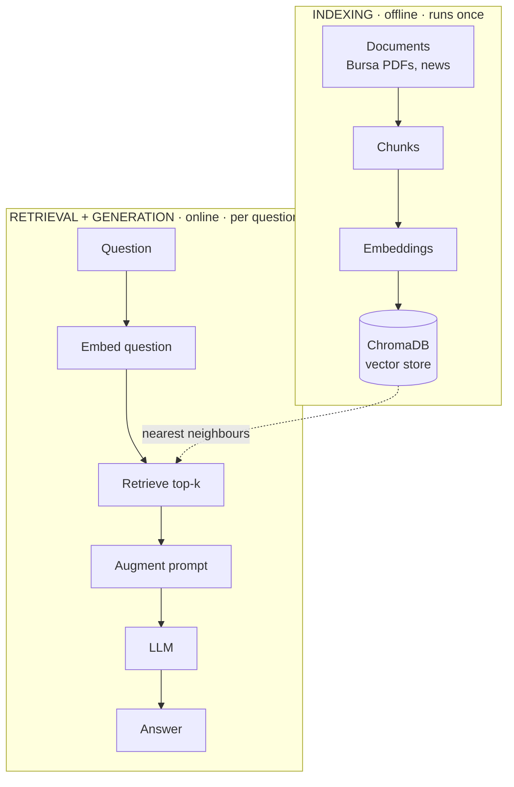
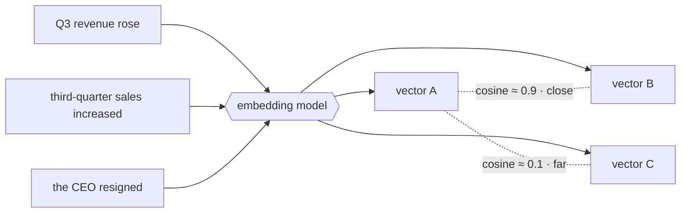
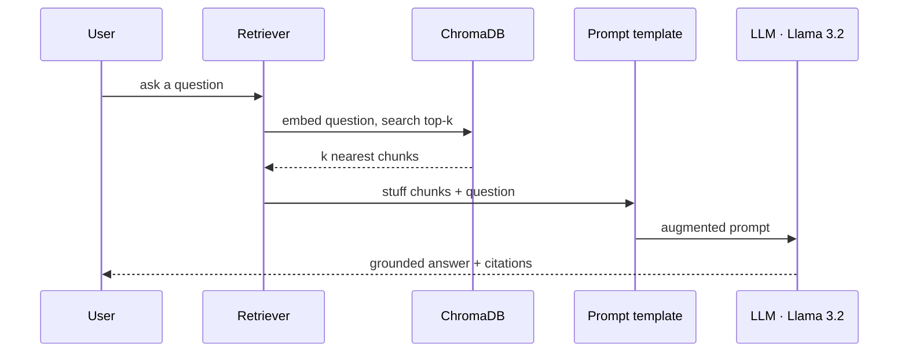
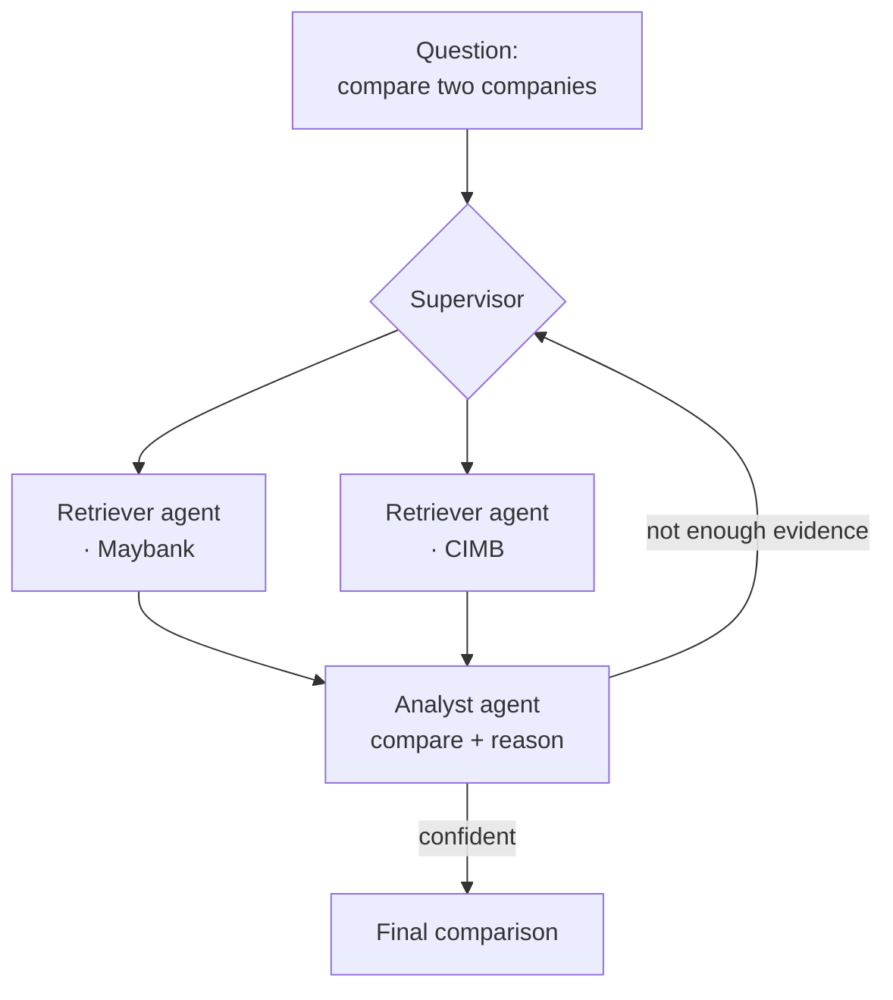

Before we get into what RAG is and its concepts, I would like to appreciate [freeCodeCamp.org](https://www.freecodecamp.org/), where they share most of their computing and programming knowledge for free so we can learn non-stop. The reason I'm getting into RAG is, _'obviously,'_ AI's rapid growth this generation. But more specifically, it's the groundwork for [[financial-malaysia-rag-system|the project]], a system that answers questions about Bursa Malaysia reports and financial news. So these notes aren't abstract. Every concept below has a home in something I'm actually building.

## What is RAG?

**RAG** stands for Retrieval-Augmented Generation. Strip the jargon and it's one idea: give the LLM an open-book exam.

A raw LLM answers from memory. Everything it "knows" was frozen into its weights at training time. That's its **parametric knowledge**: useful, but frozen, generic, and untraceable. RAG bolts on a second kind. This one is **non-parametric knowledge**, fetched fresh from an external source at question time and pasted into the prompt.

> [!NOTE] The one-line mental model
> `answer = LLM( question + retrieved_context )`
> That's the whole trick. Everything else in this note is just *how* you build a good `retrieved_context`.

Think of a librarian. Ask them a niche question and they don't recite from memory. They walk to the right shelf, pull the relevant pages, *then* answer with the book open. RAG is that walk to the shelf. The LLM is the librarian, retrieval is the walk.

## Why bother? (the problem RAG solves)

An LLM on its own has three problems that matter for a financial tool:

1. **Hallucination.** Asked something it doesn't know, it confidently makes things up. Fine for a poem. Catastrophic for "what was this company's FY2025 net profit?"
2. **Stale knowledge.** Its training cut off at some date. It has never seen last quarter's Bursa filing, and never will.
3. **No private or local docs.** It has *never read* a Bursa Malaysia annual report. That corpus simply isn't in its weights.

RAG fixes all three at once. Retrieve the actual filing, hand it over, and the model answers from the page in front of it. Current, grounded, and **citable** (you know which chunk the answer came from).

> [!TIP] Pick RAG before fine-tuning
> Fine-tuning bakes new behaviour into the weights. RAG feeds new *facts* at runtime. For a knowledge problem, meaning "know the contents of these documents," RAG is cheaper, updatable (drop in a new PDF, done), and traceable. Fine-tuning is for *style and behaviour*. It needs labelled data you almost certainly don't have, and it goes stale the moment a new report drops. Reach for fine-tuning later, if ever.

## The two-phase pipeline

Here's the part that clicked for me. RAG isn't one flow, it's two, and they run at different times.

| Phase | When | What happens | Runs |
|-------|------|--------------|------|
| **Indexing** | Offline, ahead of time | Turn your documents into a searchable store | Once (or when docs change) |
| **Retrieval + Generation** | Online, per question | Look things up, then answer | Every single query |

You build the library once. You walk to the shelf every time someone asks. Keep these two apart in your head and the whole architecture stops being confusing.



Notice the two lanes only touch at one point, the vector store. Indexing *fills* it, retrieval *queries* it. That single shared box is the whole seam between "prepare" and "answer."

## Indexing: building the library

### 1. Load

Get the raw documents *into* the system. For the project that's Bursa Malaysia PDFs, news articles, and filings. Messy, real-world sources. LangChain calls the tools for this **document loaders**, and there's one for basically every format (PDF, HTML, CSV, web pages).

```python
# each loader returns a list of Document objects: text + metadata
from langchain_community.document_loaders import PyPDFLoader

docs = PyPDFLoader("bursa/annual_report_2025.pdf").load()
```

Output: a pile of `Document` objects, each carrying `page_content` (the text) and `metadata` (source and page number, which you should keep, it's your future citation).

### 2. Split / chunk

You cannot stuff a 200-page annual report into one prompt. Context windows are finite, and even if it fit, burying the relevant sentence in 200 pages of noise wrecks retrieval quality. So you **chunk**, slicing each document into bite-sized pieces (say a few hundred tokens each).

> [!NOTE] What's a "context window"?
> The **context window** is the model's short-term memory. It's the maximum number of **tokens** (roughly ¾ of a word each) it can read in one go. Llama 3.2 tops out around 128k tokens, and a single annual report can blow past that on its own. Even if it fit, you'd pay for thousands of irrelevant tokens and dilute the model's attention across them. Chunking exists so you only ever hand over the few hundred tokens that actually matter.

> [!IMPORTANT] Overlap is not optional
> Split naïvely and you'll guillotine a sentence (or a table) right down the middle, orphaning the half that held the answer. Use a **chunk overlap** (e.g. 200 chars) so consecutive chunks share a margin and no idea gets cut in two. Chunk *size* and *overlap* are the two dials you'll tune the most.

```python
from langchain_text_splitters import RecursiveCharacterTextSplitter

splitter = RecursiveCharacterTextSplitter(
    chunk_size=1000,      # characters per chunk
    chunk_overlap=200,    # shared margin so nothing gets cut in half
)
chunks = splitter.split_documents(docs)
```

### 3. Embed

Now the interesting bit. How does a computer decide two chunks are "about the same thing"? It can't read. So we turn text into numbers, specifically a **vector**, which is a long list of floats (e.g. 384 of them) that encodes *meaning*.

The magic property: **semantically similar text lands close together in this vector space.** "Q3 revenue rose" and "third-quarter sales increased" share almost no keywords but point in nearly the same direction. That's the whole reason RAG beats keyword search. It matches on *meaning*, not spelling.



Why does this matter for finance? A keyword index asked about "revenue" would miss a filing that only ever says "turnover" or "top line." Embeddings don't care about the exact word. "Revenue," "turnover," and "top line" all land in the same neighbourhood. You retrieve on *concept*, which is exactly what a messy real-world corpus of Malaysian filings needs.

You get these vectors from an **embedding model**. No need to train one, just grab a pretrained sentence-transformer off HuggingFace. (The model is a transformer under the hood, so if you want the mechanism behind it, see [[transformer-attention|the attention note]].)

```python
# all-MiniLM-L6-v2: small, fast, free, 384 dims, a great starting point
from langchain_huggingface import HuggingFaceEmbeddings

embeddings = HuggingFaceEmbeddings(model_name="all-MiniLM-L6-v2")
```

"Close together" has a precise meaning: **cosine similarity**, the angle between two vectors. Same direction gives a score near 1 (similar). Perpendicular gives near 0 (unrelated).

```python
# intuition only, the vector store does this for you
import numpy as np
def cosine(a, b):
    return np.dot(a, b) / (np.linalg.norm(a) * np.linalg.norm(b))
```

### 4. Store

Embed every chunk and you've got thousands of vectors. You need somewhere that can hold them *and* answer "which vectors are nearest to this one?" fast. That's a **vector store** (a.k.a. vector database). For the project that's **ChromaDB**, which is free, local, runs in a Python process, and needs no server to babysit.

```python
from langchain_chroma import Chroma

# embeds each chunk and persists the vectors, this IS the indexing step
store = Chroma.from_documents(chunks, embeddings, persist_directory="./chroma")
```

Run this once. The library is now built. Everything above happens *before* anyone asks a question.

## Retrieval + Generation: answering a question

### 5. Retrieve

Someone asks: *"How did Maybank's FY2025 profit compare to CIMB's?"* Embed **the question** with the same model, then ask the store for its nearest neighbours, the **top-k** most similar chunks (k is just how many you pull back, e.g. 4).

```python
retriever = store.as_retriever(search_kwargs={"k": 4})
context = retriever.invoke("How did Maybank's FY2025 profit compare to CIMB's?")
# -> the 4 chunks whose meaning sits closest to the question
```

Two dials live here, and they pull against each other:

- **`k`** is how many chunks to pull back. Too low and you starve the model of context. Too high and you drown the answer in noise (and burn context-window budget). 4 to 6 is a sane starting point.
- **similarity threshold** is an optional floor on the cosine score, so genuinely unrelated chunks get dropped rather than padded in just to hit `k`. Better to return *two* good chunks than four where two are junk.

> [!NOTE] Tuning `k` is a real knob, not an afterthought
> For multi-company comparison you often want a *larger* `k` (you need evidence from both Maybank *and* CIMB), whereas a single-fact lookup wants a *small* `k`. Same pipeline, different `k`. This is one of the first things I'll sweep when the project's answers feel thin or noisy.

> [!WARNING] Garbage retrieval, garbage answer
> The LLM can only be as good as the chunks you hand it. If retrieval pulls the wrong pages, the model will fluently answer from the wrong pages. Most RAG debugging is *retrieval* debugging, so inspect what came back before you blame the model.

### 6. Augment + Generate

Final step. Stitch the retrieved chunks into a prompt alongside the question. That's the **augment**. Then hand the whole thing to the LLM to write the answer.

```python
prompt = f"""Answer using ONLY the context below. If it's not there, say you don't know.

Context:
{context}

Question: {question}
"""
```

Then generate. For the project the model is **Ollama running Llama 3.2** locally (free and private, the financial data never leaves the machine), with **Gemini** as a heavier cloud fallback.

```python
from langchain_ollama import ChatOllama
answer = ChatOllama(model="llama3.2").invoke(prompt)
```

That "use ONLY the context" instruction is doing real work. It's the leash that keeps the model grounded in the filing instead of wandering back to its frozen, generic memory.

Zooming out, here's the whole runtime path a single question takes, every arrow above, in order:



Every step is inspectable. When an answer looks wrong, you can print exactly what came back from `DB` and see whether the fault was *retrieval* (wrong chunks) or *generation* (right chunks, bad reasoning).

> [!NOTE] "Looks right" isn't a metric, so measure retrieval
> Eyeballing a few answers doesn't scale. The honest question is: *for a known question, did the correct chunk actually make it into the top-k?* That's measurable. Build a small set of question and expected-source pairs, then score **hit-rate / recall@k** (how often the right chunk shows up). Retrieval quality caps everything downstream, so it's the first thing worth evaluating. Answer-quality metrics (faithfulness, groundedness) come after. Its own note, later.

## Where the multi-agent bit fits (LangGraph)

Everything above is single-shot RAG: one question, one retrieval, one answer. But *"compare Maybank and CIMB"* isn't one lookup. It's retrieve for Maybank, retrieve for CIMB, then reason across both. That's where **multi-agent** comes in, orchestrated with **LangGraph**.

Rough shape, kept deliberately simple for now:

- a **retriever agent** that fetches the right chunks per company, and
- an **analyst agent** that compares the retrieved figures and writes the verdict.



The loop-back arrow is the whole point of a *graph* over a straight chain. If the analyst decides it's missing a number, it can send control back to the supervisor for another retrieval pass instead of hallucinating the gap. LangGraph is the wiring for exactly this. I'm treating it as the *next* layer, since the RAG core above has to be solid first. Notes on the agent graph will get their own page.

## How this maps to what we're building

| RAG stage | In [[financial-malaysia-rag-system]] |
|-----------|--------------------------------------|
| Load | Bursa Malaysia PDFs & news → LangChain document loaders |
| Chunk | `RecursiveCharacterTextSplitter`, size + overlap |
| Embed | HuggingFace sentence-transformers (`all-MiniLM-L6-v2`) |
| Store | ChromaDB (local, persistent vector store) |
| Retrieve | LangChain retriever, top-k similarity search |
| Augment + Generate | Ollama (Llama 3.2) local, Gemini fallback |
| Orchestrate | LangGraph multi-agent graph (multi-company comparison) |
| Serve | FastAPI backend + Streamlit UI |

Built with [Preeti](https://github.com/prt72), entirely from free and open-source pieces.

> [!CAUTION] Don't over-engineer the first pass
> It's tempting to reach straight for the fanciest embedding model, reranking, and a five-agent graph. Resist. Get the boring pipeline (load → chunk → embed → store → retrieve → generate) working end-to-end on *one* Bursa report first. You can't tune what you can't run.
